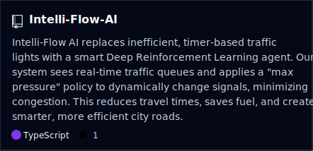
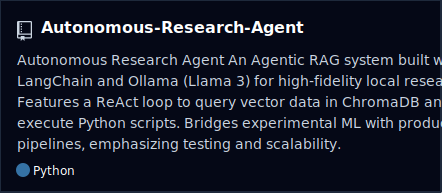
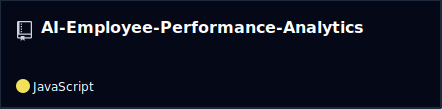
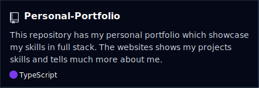

<div align="center">


<br>

# Hi, I'm Yash Bansal 👋

### Software Engineer • Backend Engineer

**Building Scalable Systems • AI-Powered Applications • Distributed Software**

<br>

<a href="https://iamyashbansal.vercel.app">
    
</a>

<a href="https://www.linkedin.com/in/iamyashbansal/">
    
</a>

<a href="mailto:iamyashbansal.dev@gmail.com">
    
</a>

<a href="https://github.com/yash-Bansal10">
    
</a>

<br><br>


</div>

---

# About Me

I'm a **Software Engineering student** specializing in **Artificial Intelligence**, with a primary interest in designing scalable backend systems, building production-ready applications, and applying AI where it creates measurable impact.

Rather than treating AI as the product itself, I enjoy engineering robust software systems that leverage AI to solve real-world problems.

## Areas of Interest

- Backend Engineering
- Software Architecture
- Distributed Systems
- Machine Learning
- AI Applications
- Developer Tools
- Open Source

---

# Currently

- Building production-ready software projects
- Learning distributed systems and system design
- Exploring agentic AI architectures
- Strengthening backend engineering fundamentals

---

# Tech Stack

## Languages

<p align="center">

</p>

## Backend Development

<p align="center">

</p>

## Frontend Development

<p align="center">

</p>

## Databases

<p align="center">

</p>

## AI & Machine Learning

<p align="center">

</p>

## Tools & Platforms

<p align="center">

</p>

<!--
# AI / ML Expertise

This section will be enabled later.

| Domain | Level |
|---------|-------|
| Machine Learning | |
| Deep Learning | |
| NLP | |
| Computer Vision | |
| MLOps | |
| LLM Engineering | |

-->
<a href="https://github.com/yash-Bansal10/Intelli-Flow-AI">

</a>

<a href="https://github.com/yash-Bansal10/Autonomous-Research-Agent">

</a>

<br><br>

<a href="https://github.com/yash-Bansal10/AI-Employee-Performance-Analytics">

</a>

<a href="https://github.com/yash-Bansal10/Personal-Portfolio">

</a>

</div>

---

# Featured Projects

## 🚦 Intelli-Flow AI

An intelligent traffic management platform that combines scalable backend services, computer vision, and machine learning to optimize traffic flow in real time.

### Highlights

- Modular backend architecture
- Computer Vision pipeline
- Machine Learning integration
- Real-time processing
- AI-assisted traffic optimization

**Tech Stack**

`Python` • `Flask` • `YOLO` • `OpenCV` • `SUMO`

---

## 🤖 Autonomous Research Agent

A multi-agent research assistant capable of autonomously planning, collecting, synthesizing, and presenting information using modern LLM workflows.

### Highlights

- Autonomous planning
- Agent orchestration
- Research automation
- Structured report generation
- Modular workflow design

**Tech Stack**

`Python` • `LangChain` • `LLMs`

---

## 📊 AI Employee Performance Analytics

A machine learning application focused on workforce analytics and predictive performance evaluation.

### Highlights

- Data preprocessing
- Predictive modeling
- Performance analytics
- Visualization dashboard
- Decision support

**Tech Stack**

`Python`

---

## 🌐 Personal Portfolio

Modern responsive portfolio built to showcase projects, technical skills, and engineering experience.

### Highlights

- Responsive UI
- Modern design
- Project showcase
- Performance optimized

**Tech Stack**

`React` • `JavaScript`

---

# Engineering Philosophy

```text
Build software that is:

• Scalable
• Reliable
• Maintainable
• Secure
• User-focused

Use AI where it improves the product—not where it merely adds complexity.
```

---

# GitHub Analytics

<div align="center">


<br><br>


</div>

---

# Contribution Activity

<div align="center">


</div>

---
---

# Featured Repositories

<div align="center">
